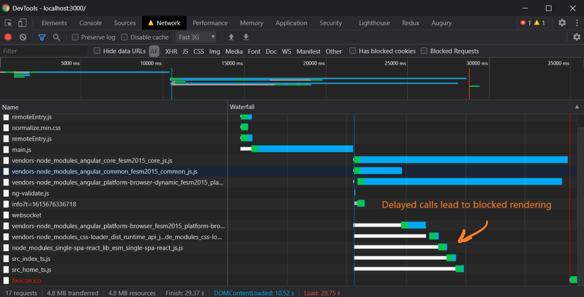
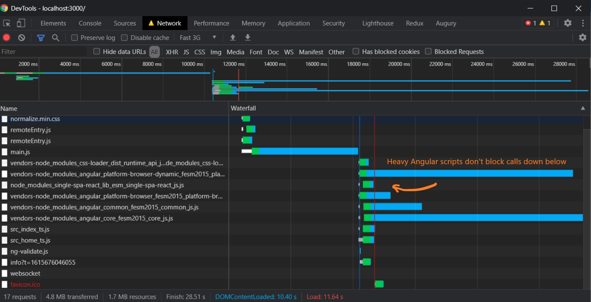
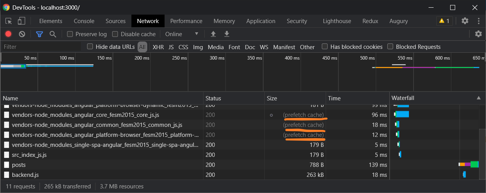

# micro-frontends-react-anguar
A Proof of Concept of using React + Angular in micro frontends. Based on single-spa + mfe

#### Install dependencies
```bash
yarn
```

#### Start application
```bash
yarn start
```

#### Develop each micro fontend separately
In theory, each micro frontend could be supported by individual teams and even be located in separate repositories. To be able to run a child application, please run this CLI command in the corresponing root folder

```bash
cd ./packages/navigation
yarn start
```

```bash
cd ./packages/posts
yarn start
```
After that the application will be available on http://localhost:{portNumber}

#### Optimizations
In order to optimize the page rendrering process, we need to take care of pre-loading the other micro frontends or, at least, base js frameworks for them. For example, when openning Home page, it's possible to preload Angular scripts for the posts. Most likely, the user will visit it.

Webpack supports this functionality using magic comments `/* webpackPreload: true */` or `/* webpackPrefetch: true */`. In our case a navigation to the page with posts won't be done immediately, so we will be relying on `webpackPrefetch`.
Here is a detail explanation how it works https://developer.mozilla.org/en-US/docs/Web/HTML/Preloading_content.

#### Prefetching in action
By default, if we try loading the Angular scripts from the main entry, the page rendering process will be blocked. Here is a screenshot:


Prefetching helps to load the scripts using browser idle time. As the result, it doesn't block a rendering process. It's clearly visible on this screen:


Having these scripts prefetched, browser will get them from cache once they're requested:


